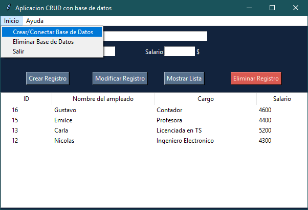

# CRUD tkinter
- Sistema de registro de personal simple
- Utilizardo para la practica de integracion entre sqlite3 y tkinter
- No cuenta con requerimientos extra con la version de python 3.9.7

___Por primera vez, la base de datos debe ser creada:___ 

